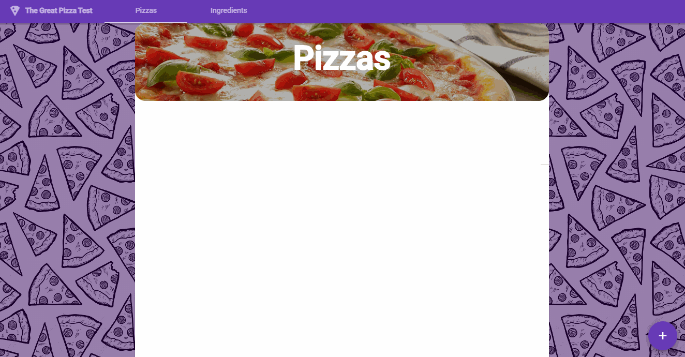
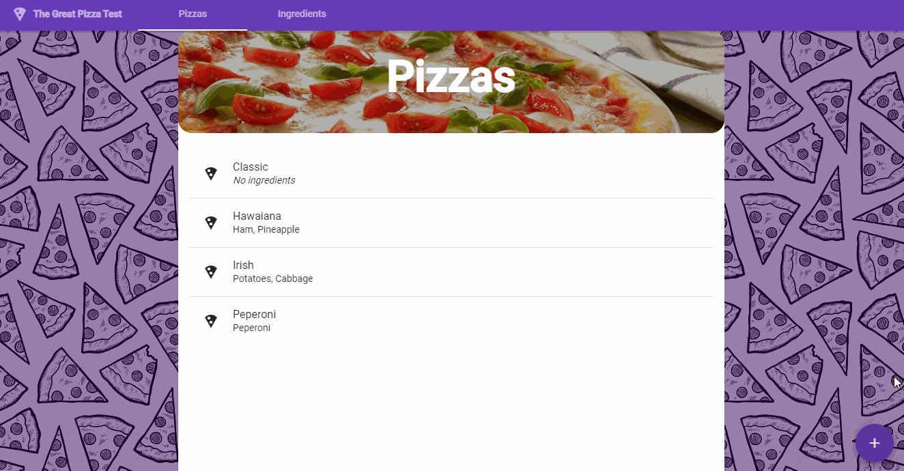
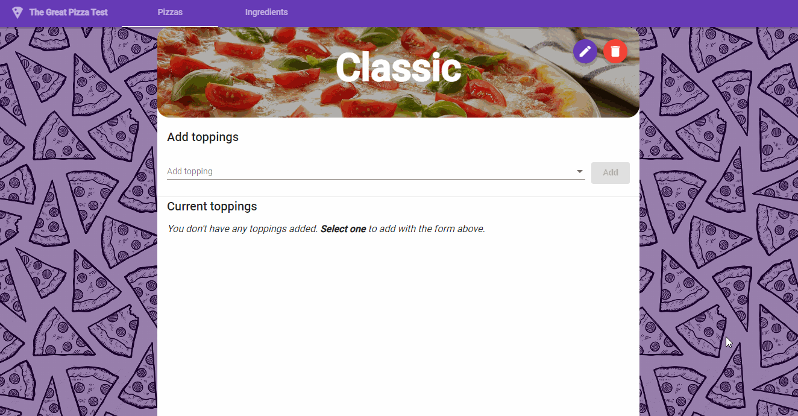

# The Great Pizza Test

### The Great Pizza Test is an exercise for Full Stack Developers, built with **ASP.NET CORE** and **SQL Server** (via EF Core) for the server, and with **Angular 11** with **Angular Material** for the web client.

<br>
<p align="center">

</p>

<br>

## Some screenshots:

<div style="display:flex; justify-content: space-around;">
<div>
<p align="center">

</p>
<p align="center">
<i>(Example: Adding a pizza)</i>
</p>
</div>

<div>
<p align="center">

</p>
<p align="center">
<i>(Example: Adding toppings on pizzas, by using existent ingredients)</i>
</p>
</div>
</div>

## Instructions:

- Run the following [SQL query](./SQL/PrepareDatabase.sql) to generate the database in SQL Server. It will delete any `TheGreatPizzaTestDB` DB that you had. _(The entities on the back-end were created using a DB-First approach)_

```sql
-- Create a database "TheGreatPizzaTestDB".
-- If it already exists, we drop it.

USE master;
GO
IF DB_ID (N'TheGreatPizzaTestDB') IS NOT NULL
DROP DATABASE [TheGreatPizzaTestDB];
GO
CREATE DATABASE [TheGreatPizzaTestDB];
GO

-- Create both tables "Pizzas" and "Ingredients", as well as a junction table
-- called "PizzaToppings" to handle their Many-to-many relationship

USE [TheGreatPizzaTestDB];
GO
CREATE TABLE [dbo].[Pizzas] (
    [Id] INT IDENTITY NOT NULL,
    [Name] NVARCHAR(50) NOT NULL,

    CONSTRAINT [PK_Pizza] PRIMARY KEY CLUSTERED ([Id])
);
CREATE TABLE [dbo].[Ingredients] (
    [Id] INT IDENTITY NOT NULL,
    [Name] NVARCHAR(50) NOT NULL,

    CONSTRAINT [PK_Ingredient] PRIMARY KEY CLUSTERED ([Id])
);
CREATE TABLE [dbo].[PizzaToppings] (
    [PizzaId] INT NOT NULL,
    [IngredientId] INT NOT NULL,

    CONSTRAINT [FK_PizzaToppings_Pizzas_PizzaId] FOREIGN KEY([PizzaId]) REFERENCES [dbo].[Pizzas]([Id]) ON DELETE CASCADE,
    CONSTRAINT [FK_PizzaToppings_Ingredients_IngredientId] FOREIGN KEY([IngredientId]) REFERENCES [dbo].[Ingredients]([Id]) ON DELETE CASCADE,

    CONSTRAINT [PK_PizzaTopping] PRIMARY KEY CLUSTERED ([PizzaId], [IngredientId])
);
GO
CREATE NONCLUSTERED INDEX [IX_PizzaToppings_PizzaId]
    ON [dbo].[PizzaToppings]([PizzaId] ASC);
CREATE NONCLUSTERED INDEX [IX_PizzaToppings_IngredientId]
    ON [dbo].[PizzaToppings]([IngredientId] ASC);
GO

-- Populate the database with example data (and some pizzas)

INSERT INTO [dbo].[Pizzas]([Name])
VALUES (N'Hawaian'), (N'Peperoni'), (N'Irish')

INSERT INTO [dbo].[Ingredients]([Name])
VALUES (N'Ham'), (N'Pineapple'), (N'Peperoni'), (N'Potatoes'), (N'Cabbage')

INSERT INTO [dbo].[PizzaToppings]([PizzaId], [IngredientId])
VALUES (1, 1), (1, 2), (2, 3), (3, 4), (3, 5)
GO
```

- Run the [`/API/src/TheGreatPizzaTest.Web`](./API/src/TheGreatPizzaTest.Web) project to start the API server. It should be running on `https://localhost:5001`.
- Run the Angular app located under [`/Web`](./Web). It should be running on `http://localhost:4200`.

## Troubleshooting

- If the DB does not connect, change the `ConnectionStrings:DefaultConnection` configuration under `appsettings.json`.
